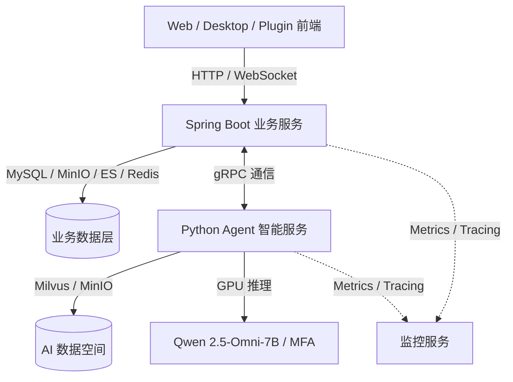

# SilverTongue (灵舌) - AI 驱动的全链路英语口语学习生态
## 产品需求文档 (PRD) v2.6

---

## 1. 项目背景与愿景 (Background & Vision)

### 1.1 项目背景
在全球化与数字化时代，英语口语沟通能力已成为求职、学术和日常交往的核心竞争力。然而，主流口语学习模式普遍存在两大瓶颈：
*   **输入与输出严重脱节**：许多学习者在观看 YouTube、Netflix、网课或阅读英文原著时积累了大量地道的语料（Enjoy 阶段），但这些语料通常被动沉淀在脑海中，缺乏高效将其转化为主动口语练习素材（Speak 阶段）的闭环工具。
*   **反馈滞后或维度单一**：传统的 AI 口语工具以级联管道（STT 语音识别 -> LLM 文本处理 -> TTS 语音合成）为主，不仅交互延迟高（通常 >3 秒），且无法感知音素级发音细节、语调变化及非母语者的情感焦虑；真人外教费用昂贵，难以提供全天候的高频、即时反馈。

### 1.2 项目愿景
**SilverTongue (灵舌)** 旨在通过创新的全域语料采集插件与前沿的端到端多模态语音 AI 技术，打通 **“采集即练习，练习即进步”** 的闭环学习生态。项目融合了 **Enjoy App (人人都能用英语)** 的多模态语料解析和 1000 小时时间追踪哲学，以及 **SpeakMaster (Oralagent)** 强大的端到端全双工语音交互、Chinglish 检测与音素级发音分析能力。

### 1.3 核心业务闭环
整个产品的核心链路为：
$$\text{采集 (Harvester)} \rightarrow \text{影子跟读 (Shadowing)} \rightarrow \text{AI 对练 (Coach)} \rightarrow \text{社区分享 (Square)} \rightarrow \text{复习内化 (Brain)}$$

---

## 2. 目标用户分析 (User Analysis)

1.  **影子跟读沉浸者 (Shadowers)**
    *   **特征**：喜欢通过美剧、电影、YouTube 学习，提倡影子跟读模仿（Shadowing）。
    *   **痛点**：缺乏工具一键捕获并裁剪视频，无法将自己跟读的录音与原声进行精准的时间轴、波形对比及细节纠音。
2.  **备考与考证族 (IELTS / TOEFL / BEC)**
    *   **特征**：有明确的提分和考试场景演练需求（如雅思口语 Part 2 / 托福口语）。
    *   **痛点**：缺乏低成本、高质量的对练对象，且需要音素级的发音分析以纠正微小的口音及辅音发音问题。
3.  **职场实用英语者 (Professionals)**
    *   **特征**：需在商务会议、商务面试、学术讨论中表现得得体、地道。
    *   **痛点**：表达常有强烈的“中式英语”（Chinglish）直译痕迹，急需即时的地道表达替换建议与静默语法纠错。

---

## 3. 核心功能模块 (Functional Requirements)

### 3.1 模块一：全域语料采集与输入 (The Harvester)
该模块旨在降低语料获取门槛，将用户的日常影音消费转化为高价值的学习输入。

*   **FR-1.1: 万能浏览器插件与一键下载器 (Omni-Capture & Downloader)**
    *   **一键剪辑**：支持在 YouTube、Netflix、Coursera 播放界面上一键截取 5-30 秒的视频/音频片段及对应的字幕。
    *   **后台直投下载**：结合 `youtubedr` / `yt-dlp` 及 `ffmpeg` 后端组件，当用户点击一键采集时，系统能在后台直接将原音视频流进行拉取、切割并同步上传至 MinIO 对象存储，避免因国内网络连接或视频下架导致的语料丢失。
*   **FR-1.2: 多模态语料解析引擎与词典集成**
    *   **高精转录与对齐**：使用 Whisper 对无字幕视频进行文本转录，利用 MFA (Montreal Forced Aligner) 自动完成音视频与字幕的词级、音素级时间轴对齐。
    *   **MDict & 剑桥词典集成**：在视频切片播放或阅读时，支持点击/划词查询。系统集成本地 MDict 离线词典解析器（支持导入 `.mdx` / `.mdd` 格式词典）及在线剑桥词典 API，即时呈现音标、中文释义，并能播放标准美音/英音发音。
*   **FR-1.3: Echo 影子跟读器**
    *   **双波形对比**：实时显示原声音频波形与用户录音波形的重叠对比，帮助用户调整语速、重音和连读节奏。
    *   **无损变速与循环**：提供 0.5x - 2.0x 无损变速播放及 A-B 段的循环播放。

### 3.2 模块二：AI 智能陪练与精准教练 (The Coach)
该模块融合了端到端语音对练和深度的表达诊断。

*   **FR-2.1: Qwen2.5-Omni 端到端多模态语音交互**
    *   **语音直达语音 (Speech-to-Speech)**：接入端到端多模态大模型 `Qwen2.5-Omni-7B`，不经过传统“语音转文本->大语言模型->文本转语音”的级联分层，极大地降低了系统交互延迟（首字节音频流延迟 TTFT 控制在 **1.0秒** 左右）。
    *   **自然打断 (Voice Break-in)**：支持全双工交互模式下，用户随时打断 AI 的播报，AI 监测到声音后立即停止输出并切换为倾听状态。
*   **FR-2.2: 全双工交互与话权决策 (Turn-taking)**
    *   **话权自动判定**：基于用户音频能量、停顿、音高变化等特征，自动判别用户是处于“表达中”、“卡壳犹豫”还是“表达结束”。
    *   **自适应静默阈值**：针对不同口语水平的学习者配置自适应静默阈值（Beginner: 2.0s; Intermediate: 1.5s; Advanced: 1.0s），避免因中途停顿被粗暴打断。
*   **FR-2.3: 发音评估双引擎**
    *   结合本地 MFA (Montreal Forced Aligner) 对准引擎（提供音素起止时间及精准到具体音节的发音对齐）与云端 Azure Speech SDK（评估准确度、流利度、完整度与韵律感），呈现高鲁棒性的评分。
*   **FR-2.4: 智能润色与中式英语检测 (The Polisher)**
    *   **中式英语识别**：识别用户口语表达中的生硬中式英语（Chinglish，如 “I very like this”），提供 2-3 种 Native Speakers 的地道表达替换建议。
    *   **静默语法纠错**：实时对话时不生硬打断纠错，保留用户表达自信；对话结束后，统一在课后总结报告中输出语法与用词纠正建议。
*   **FR-2.5: 引导式补全与表达提示 (Guided Scaffolding)**
    *   当话权判定系统检测到用户“卡壳”且无法继续时，系统基于当前的对话上下文和用户所选的主题，在界面上实时生成 2-3 个符合其当前水平的“短句补全提示”或“关键词气泡”，帮助用户继续对话。

### 3.3 模块三：语伴社交与实时互动 (The Square & Meeting)
该模块构建真人互动学习大厅与 UGC 共享。

*   **FR-3.1: Live Meeting 语音大厅**
    *   基于 WebRTC 协议实现低延迟的真人 1v1 语音匹配对练，或多人主题研讨房间。提供在线“话题卡”和“生词辅助卡”，防止尴尬冷场。
*   **FR-3.2: UGC 语料共享社区**
    *   支持用户分享自制的高分跟读片段、电影台词语料包。社区内帖子和评论支持 Elasticsearch 全文检索。

### 3.4 模块四：数据仪表盘与 SRS 系统 (The Brain)
该模块为用户提供记忆强化与进度可视化。

*   **FR-4.1: 1,000 小时进度追踪仪表盘**
    *   直观的热力图进度跟踪，精确区分输入时长（听、看、词典查词）与输出时长（影子跟读说、AI 场景对话说）。
*   **FR-4.2: 智能闪卡系统 (SRS)**
    *   将用户日常看视频过程中的查词历史（User Lookups）和 AI 对练中的语法错句、Chinglish 表达，自动导入复习库，基于 SuperMemo 记忆算法（艾宾浩斯曲线）动态调度下一次复习时间。

---

## 4. 技术架构设计 (Technical Architecture)

为了提升开发效率、降低系统复杂度并保证服务间的通信性能，系统采用 **gRPC 三服务架构** 设计：

### 4.1 服务划分与职责

1.  **Spring Boot 业务服务 (Spring Boot Service)**
    *   **接口入口**：为前端用户端及管理端提供统一的 RESTful API、WebSocket 信令连接（实时 Live Meeting 语音房间中转）。
    *   **业务逻辑**：负责用户账号、好友社交、积分勋章、语料切片元数据管理、SRS 闪卡卡片算法排程、以及社区 UGC 帖子与评论处理。
    *   **存储操作**：直接读写 MySQL 关系表、MinIO 公有/私有桶、Elasticsearch 索引、以及 Redis 高频缓存。
2.  **Python Agent 智能服务 (Python Agent Service)**
    *   **AI 调度中枢**：基于 FastAPI 结合 LangGraph 对话图谱，负责多轮口语对话状态、场景上下文分流、RAG 向量检索路由。
    *   **发音与评估**：负责集成本地 MFA 强制对准引擎（Montreal Forced Aligner）、声学模型评分、以及中式英语规则检测过滤。
    *   **语音推理接口**：负责调度端到端 Qwen2.5-Omni 多模态大模型，以流式传输接收和响应音频 byte 数据。
    *   **gRPC 协议暴露**：不直接向外暴露 HTTP HTTP 端口，而是通过高并发的 gRPC 服务提供底层智能分析接口，供 Spring Boot 服务远程过程调用。
3.  **统一监控服务 (Monitoring Service)**
    *   **指标采集**：利用 Prometheus 定期抓取 Spring Boot（结合 Actuator）与 Python Agent 服务的性能指标。
    *   **全链路追踪**：利用 Jaeger/SkyWalking 或 gRPC 拦截器实现 Spring Boot 到 Python Agent 服务的全链路追踪（Tracing）。
    *   **日志与可视化**：使用 ELK (Elasticsearch/Logstash/Kibana) 或 Grafana Loki 收集集中式日志，在 Grafana 仪表盘展示服务 QPS、延迟和异常数。

### 4.2 gRPC 高效通信设计
*   **低延迟音频流式交互**：在影子跟读评分和 Qwen2.5-Omni 对话场景中，音频字节流通过 **gRPC Bidirectional Streaming (双向流)** 进行低开销传输，极大降低了 HTTP 拆包组包的延迟。
*   **强契约规范**：通过编写统一的 `.proto` 接口描述文件（包含 Agent 交互、发音评测、Chinglish 检测等契约），自动生成 Java 和 Python 的桩代码（Stub），避免因前后端字段定义不一致导致的解析错误。

### 4.3 边缘模型节点部署与加速 (Cloudflare Tunnel & GPU)
*   **Cloudflare Tunnel (MyPC)**：用于暴露前端用户端和 Spring Boot 业务服务，实现外部公网穿透访问。
*   **Cloudflare Tunnel (NeoLingua)**：连接外部 GPU 算力集群（如 NVIDIA A40），部署 Python Agent 的核心推理节点。
    *   **智能显存避让机制 (Smart Memory Release)**：当推理节点空闲超过 10 分钟时，自动卸载 Qwen2.5-Omni 模型并释放 GPU 显存；且实时监控 GPU 显存，当可用显存低于 8GB 时主动让出通道。

---

## 5. 非功能性需求 (Non-Functional Requirements)

*   **通信时效性**：gRPC 通信交互首包处理耗时应控制在 **50ms** 以内；全双工对话下，Qwen2.5-Omni 首字节音频流延迟（TTFT）必须控制在 **1.2 秒**以内。
*   **系统监控覆盖率**：核心接口（如发音评估、AI 会话、WebSocket 房间心跳）的 gRPC 调用度量覆盖率需达到 **100%**。
*   **显存安全性**：推理服务器具备显存自检和超时自动释放，防止服务器挂起或 GPU OOM。

---

## 6. 实施路线图 (Roadmap)

1.  **阶段一：融合期 (M1 - 基础语料与跟读)**
    *   编写统一的 gRPC `.proto` 合约，自动生成 Java/Python 桩代码。
    *   打通浏览器插件采集、后台 `youtubedr` 自动下载与 MinIO 归云存储流程。
    *   上线 Echo 影子跟读器（通过 gRPC 调用 Python 服务的本地 MFA 音素打分引擎）。
2.  **阶段二：强化期 (M2 - AI 对练与智能润色)**
    *   部署基于 gRPC Bidirectional Streaming 的 Qwen2.5-Omni 推理服务，实现 Speech-to-Speech 实时交互。
    *   接入 LangGraph 动态场景与 RAG 向量记忆检索（Milvus）。
    *   上线 The Polisher（中式英语检测与静默纠错）和“卡壳”引导式补全气泡。
3.  **阶段三：社区期 (M3 - 社交大厅与 SRS 闭环)**
    *   上线基于 WebRTC 的 Live Meeting 真人语音对练及好友系统。
    *   集成 Prometheus + Grafana 监控服务，对 Spring Boot 和 Python 服务进行全面探活和 QPS 监控。
    *   打通完整的 SRS 艾宾浩斯复习卡片循环，完成全链路口语学习闭环。
